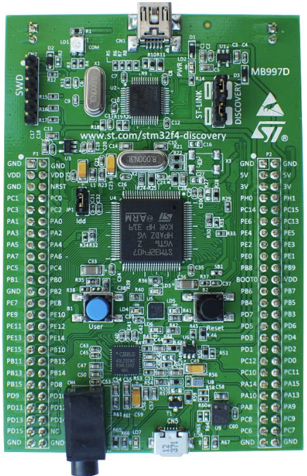

# 🚀 STM32F407VG Bare-Metal Blink

Bare-metal LED blinking project for the STM32F4Discovery board, with no HAL, no CMSIS, and no RTOS — just clean C and direct register access.  


## 🧠 About this Project

This project blinks the green LED (PD12) of the STM32F407VG Discovery board using:

- Direct access to registers (RCC, GPIOD)  
- Minimal assembly in startup.s  
- Custom linker script linker.ld  
- Built with arm-none-eabi-gcc  
- Flashed using ST-LINK_CLI  
- Timebase implementation with Systick for delays

## 💡 What's cool about this project

- How to initialize an ARM MCU without any library  
- How to configure GPIOs at the register level  
- What happens during MCU boot/reset  
- How to compile and flash a real bare-metal binary  

## ⚙️ Requirements

Make sure you have the following tools installed (was developed in Windows 11):

- arm-none-eabi-gcc 12 or newer (from Arm GNU Toolchain)  
- make (via MSYS2 or Chocolatey)  
- ST-LINK Utility (ST-LINK_CLI.exe)  

## 📁 Project Structure

The project is organized as follows:

stm32f407_baremetal_blink/  
├── src/
│ ├── main.c → Main blink logic (LED toggling on GPIOD)
│ └── startup.s → Minimal startup code and vector table
├── inc/
│ └── stm32f4xx.h → STM32F4 device header (includes register definitions)
├── device/
│ ├── system_stm32f4xx.c → System clock configuration and SystemCoreClock setup
│ └── stm32f407xx.h → MCU-specific peripheral register definitions
├── cmsis_core/
│ ├── core_cm4.h → CMSIS core support for Cortex-M4
│ ├── cmsis_compiler.h → Compiler abstraction macros
│ ├── cmsis_version.h → CMSIS version metadata
│ └── mpu_armv7.h → Optional MPU support (used by core_cm4.h)
├── linker.ld → Linker script defining flash and RAM layout
├── Makefile → Build rules for compiling and linking

## 🔨 How to Build and Flash

To build the project, open a terminal in the project folder and run:

make

To flash it to the board using ST-LINK CLI:

make flash

Make sure that the ST-LINK_CLI.exe path is correctly set in the Makefile.

## 🔎 Code Overview

In main.c:  
- RCC->AHB1ENR |= (1 << 3); enables the clock for GPIOD  
- GPIOD->MODER |= (1 << (12*2)); sets PD12 as output  
- GPIOD->ODR ^= (1 << 12); toggles the green LED  

In startup.s:  
- The vector table is defined with stack top and Reset_Handler  
- Reset_Handler calls main, then enters an infinite loop  

## ⏱️ Timebase (SysTick)

This project uses the **SysTick timer** from the ARM Cortex-M4 core as a millisecond-resolution *timebase*, allowing precise delays and time interval measurements without relying on external peripherals.

### ⚙️ How It Works

- The `timebase_init(hz)` function configures `SysTick` to generate interrupts at the specified frequency (`hz`).
- Each interrupt automatically triggers the `SysTick_Handler` function, which increments the global variable `g_tick_ms` once per tick.
- The `get_tick()` function returns the current tick count in milliseconds.
- The `delay_ms(ms)` function blocks execution for a defined number of milliseconds, based on tick difference.

### 🧪 Usage Example

```c
timebase_init(1000); // Configure SysTick for 1ms interval (1000Hz)
...
delay_ms(500);       // Wait for 500ms
```


### 📌 Target Board

- Board: STM32F4Discovery  
- MCU: STM32F407VG (Cortex-M4 @ 168 MHz)  
- LED used: PD12 (green LED on board)  

*note: if you have another stm32 board, look at the reference manual and the user manual of your board to adapt the GPIO ports used*


 


## 📖 References

- STM32F4 Reference Manual (RM0090)  
- STM32F4Discovery User Manual (UM1472)  
- ARM Cortex-M4 Technical Reference Manual  

## 👨‍💻 Author

Juan Pedro — Embedded systems engineer passionate about bare-metal development, critical inspection tools, and real-time aerospace software.

## 📝 License

MIT License
