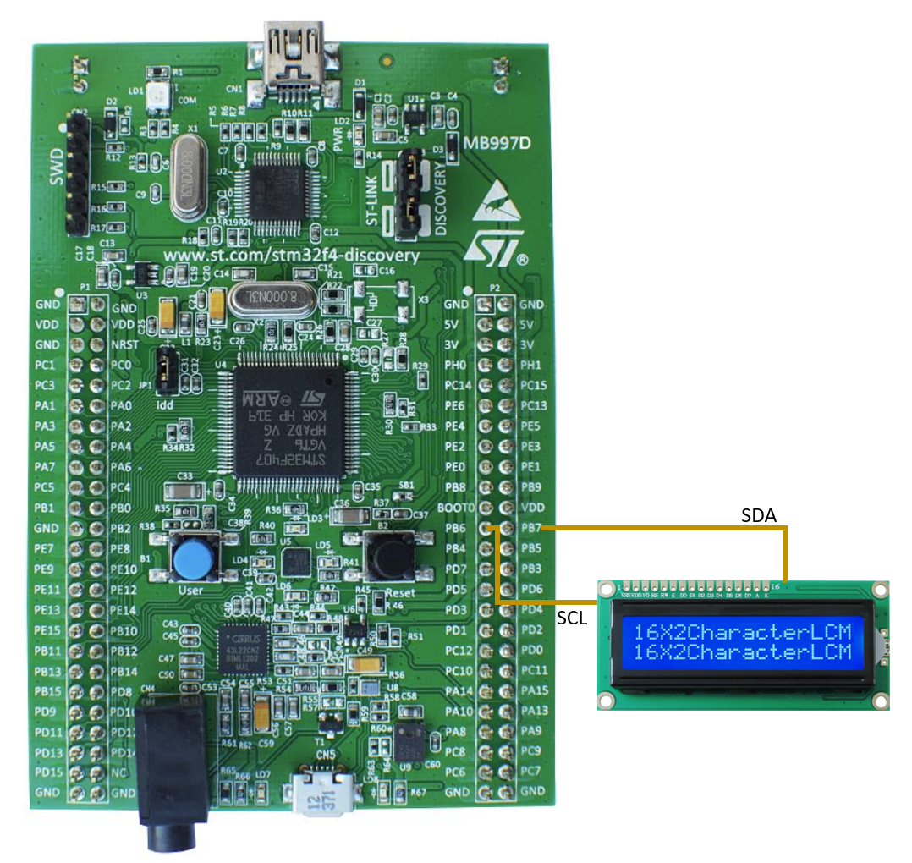

# 🚀 STM32F407 Bare-Metal Fun

This roadmap outlines a set of practical and fun features to build on top of a fully bare-metal STM32F407VG project — no HAL, no C++ classes, no bloated frameworks. Just pure registers, bitwise operations, and blinking LEDs.

---

## ✅ Phase 1 – Core Setup
- [x] ✅ Minimal project with Makefile, linker script, and startup code
- [x] ✅ LED blinking using SysTick-based delay
- [x] ✅ 16x2 LCD over I2C (PCF8574T) working with custom driver
- [x] ✅ Basic GPIO control (output, toggling)

---

## 🛰️ Phase 2 – Communication Playground
- [ ] ☐ UART printf (USART2 to USB)
- [ ] ☐ UART receive with interrupts and circular buffer
- [ ] ☐ UART + DMA combo (non-blocking transfers)
- [ ] ☐ Serial menu for fun interaction (change LED speed, show time, etc.)

---

## 🔍 Phase 3 – Reading the World
- [ ] ☐ ADC read from potentiometer
- [ ] ☐ I2C temperature sensor (e.g., LM75 or BMP180)
- [ ] ☐ External EEPROM over I2C (store boot counters, user config)
- [ ] ☐ HC-SR04 distance sensor with input capture

---

## ⏱️ Phase 4 – Timer Tricks
- [ ] ☐ PWM LED brightness control
- [ ] ☐ Servo motor via PWM (angle control)
- [ ] ☐ Output Compare to schedule blinking events
- [ ] ☐ Rotary encoder support with TIMx in encoder mode

---

## 🎛️ Phase 5 – UI & Interaction
- [ ] ☐ LCD menu navigation using buttons
- [ ] ☐ Buzzer tone generator using PWM
- [ ] ☐ LED color selector via potentiometer + LCD
- [ ] ☐ Debounced button logic with interrupts

---

## 📈 Phase 6 – Debug & Profiling
- [ ] ☐ Display runtime diagnostics on LCD
- [ ] ☐ Toggle GPIO for scope-based performance measurement
- [ ] ☐ Print stack usage via linker map or estimation
- [ ] ☐ UART dump of memory regions or registers

---

## 🧨 Phase 7 – Advanced Toys
- [ ] ☐ Watchdog timer experiment (IWDG)
- [ ] ☐ Basic bootloader switchable via button
- [ ] ☐ Low-power modes (stop/sleep) with wakeup pin
- [ ] ☐ Light encryption (XOR or software AES)

---

## 🧪 Mini-Project Ideas
- [ ] ☐ Stopwatch on LCD with start/pause/reset buttons
- [ ] ☐ Temperature logger with EEPROM and timestamp
- [ ] ☐ Servo-based safe lock controlled via serial input
- [ ] ☐ Morse code generator using LED + buzzer

---

## 🛠️ Tools & Extras
- [ ] ☐ Play with `arm-none-eabi-nm`, `objdump`, `size`, `.map`
- [ ] ☐ Generate `.bin` and `.hex` from ELF using Make
- [ ] ☐ Organize drivers per peripheral (modular structure)
- [ ] ☐ Build custom delay macros using DWT or SysTick

---

🎯 **Goal:** Build cool things from scratch, explore hardware capabilities, and push your STM32F407 to its limits — all without relying on HAL or RTOS. Just you, the datasheet, and the bare metal.

## Project Board

